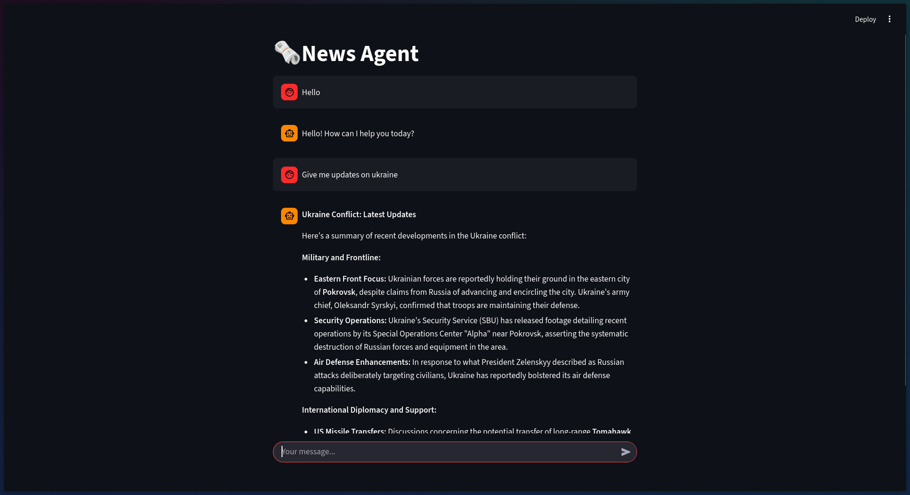

# 🗞️ RAG-News-Agent

An **AI-powered news assistant** that can answer questions from a **local news database** or perform a **live web search** when information is missing — powered by **LangChain**, **FAISS**, **Ollama embeddings**, and **Google Gemini API**.



## Overview

This project combines **Retrieval-Augmented Generation (RAG)** with intelligent tool use.
It:

* Crawls articles from multiple trusted news outlets (via `newspaper3k`).
* Builds a local **FAISS vector index** for semantic retrieval using **Ollama embeddings**.
* Uses a **Gemini (Google Generative AI)** model for conversational reasoning.
* Falls back to **DuckDuckGo web search** when local data lacks answers.
* Runs inside **Streamlit chat interface**.

## Features

* Build a semantic index from real news sources
* Local + Web hybrid RAG retrieval
* Conversational ReAct-style agent with reasoning steps
* Session-based memory for contextual responses
* API key input popup (secure, per-session)
* Deployable both locally and **Hugging Face Spaces** (with minor tweaks)

## Project Structure

```bash
News-RAG/
│
├── build_index.py        # Scrapes articles & builds FAISS vector index
├── retrieve_utils.py     # Utilities for news retrieval & FAISS creation
├── agent_utils.py        # For tools, agent, and response handling
├── base_logic.py         # CLI-based agent runner for quick testing
├── streamlit.py          # Streamlit UI (Gemini API popup + chat interface)
└── news_index/           # Saved FAISS index (auto-created)
```

## Workflow

1. **Retrieve News Articles** -
   Uses `newspaper3k` to scrape and summarize articles from provided sources. These sources can be set as per your choice in `build_index.py`

2. **Build Local FAISS Index**
   Embeds article summaries with `OllamaEmbeddings(model="qwen3-embedding:0.6b")`
   → Stored locally for fast vector retrieval. Any embedding model can be used, depends upon the hardware.

3. **Hybrid RAG Agent**

   * First searches the local FAISS index.
   * If results are irrelevant, performs a **DuckDuckGo** web search.
   * Responds using a **Gemini** or **Ollama** chat model with reasoning-style prompting.

4. **Streamlit Chat Interface**

   * Prompts user for Gemini API key once per session.
   * Stores key in session memory.
   * Displays conversation in a chat format.

>You can remove the gemini api prompt if using local Ollama model

## Installation

### 1. Clone the repo

```bash
git clone https://github.com/<your-username>/News-RAG.git
cd News-RAG
```

### 2. Install dependencies

It’s best to use a virtual environment:

```bash
pip install -r requirements.txt
```

### (Optional) Set up Ollama (for local embeddings)

Install and run Ollama:

**For Linux**
```bash
curl -fsSL https://ollama.com/install.sh | sh
ollama pull qwen3-embedding:0.6b
```

**For Windows**
```pwsh
winget install --id=Ollama.Ollama  -e
ollama pull qwen3-embedding:0.6b
```

### 3. Get your Gemini API key

* Go to [Google AI Studio](https://aistudio.google.com/app/apikey)
* Generate an API key (free)

>You may encounter rate limit occasionally


### 4. Build the Index

Run this once to scrape and index articles:

```bash
python build_index.py
        or
py build_index.py
```

This will:

* Fetch articles from provided sources.
* Save them to `articles.csv`.
* Build and store the FAISS index in `news_index/`.


## Run the Chat Interface

```bash
streamlit run streamlit.py
```

## 🧩 Switching Embedding Models

For deployment on **Hugging Face Spaces** (where Ollama isn’t available),
use a lighter model like `google/embedding-gemma-2-300m` or
`BAAI/bge-base-en-v1.5`.

```python
from langchain_community.embeddings import HuggingFaceEmbeddings
embeddings = HuggingFaceEmbeddings(model_name="google/embedding-gemma-2-300m")
```

Then rebuild your index:

```bash
python build_index.py
```

### **Working**

